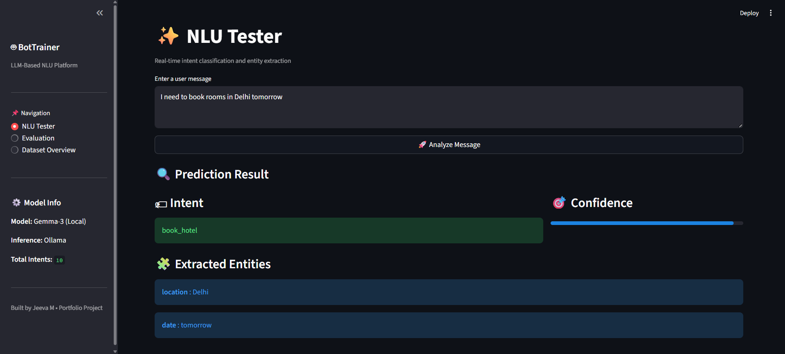
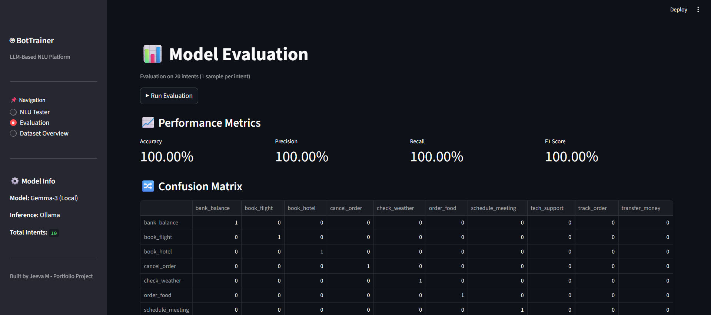
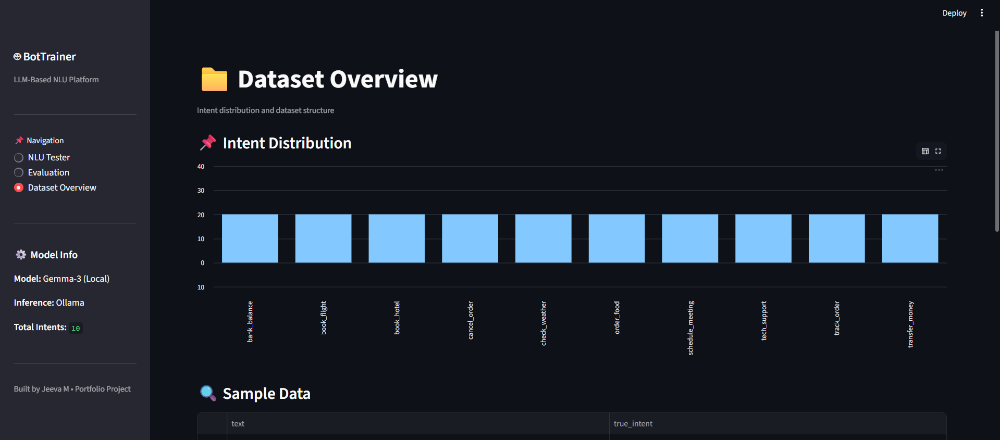
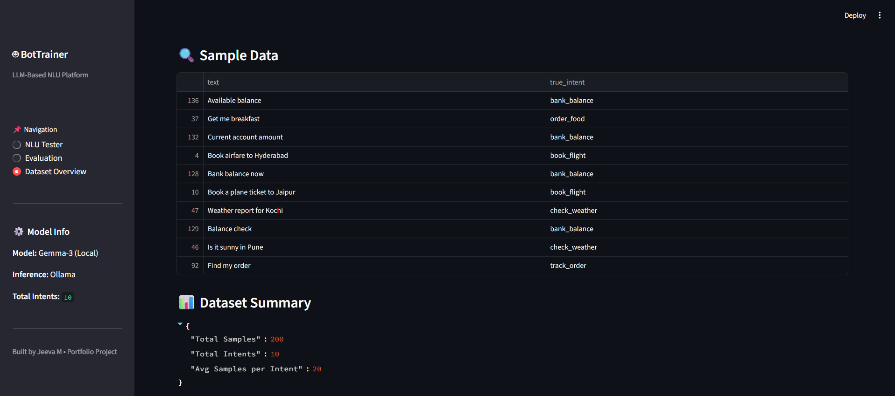

# 🤖 BotTrainer – LLM-Based NLU Model Trainer & Evaluator

BotTrainer is an **end-to-end LLM-powered Natural Language Understanding (NLU) platform** designed to perform **intent classification and entity extraction** using **prompt engineering** instead of traditional machine learning classifiers.

The system uses a **JSON-first dataset design**, a **local Gemma-3 model (via Ollama)**, and provides **real-time inference, evaluation dashboards, and dataset analytics** through an interactive **Streamlit UI**.

---

## 🚀 Key Highlights

- 🔹 LLM-based NLU (no classical ML intent classifiers)
- 🔹 JSON-driven intent & entity schema
- 🔹 Prompt-engineered structured output
- 🔹 Local inference using **Gemma-3**
- 🔹 Evaluation on multiple intents with metrics & confusion matrix
- 🔹 Clean, modular, production-style project structure
- 🔹 Interactive UI for testing, evaluation, and dataset insights

---

## 🎯 Project Objectives

- Replace traditional intent classifiers with **LLM prompt-based inference**
- Perform **intent detection + entity extraction** in one pass
- Enforce **structured JSON output** from LLMs
- Evaluate NLU performance using:
  - Accuracy
  - Precision
  - Recall
  - F1-score
  - Confusion Matrix
- Provide a **real-time UI** for testing and evaluation
- Follow **industry-grade ML project structure**

---

## 🧠 System Architecture (High-Level)

```
User Input
   ↓
Prompt Template + Intent Schema
   ↓
Gemma-3 (Local LLM via Ollama)
   ↓
Structured JSON Output
   ↓
Intent & Entity Parsing
   ↓
Evaluation + UI Visualization
```

---

## 📦 Dataset Design

### 1️⃣ Primary Dataset – `intents.json` (Core Dataset)

The system is **JSON-first**, meaning the LLM directly consumes the intent schema.

Each intent contains:
- Intent name
- Training examples
- Supported entity types

#### Example

```json
{
  "intents": [
    {
      "name": "book_flight",
      "examples": [
        "Book a flight to Delhi",
        "I want to fly to Mumbai tomorrow"
      ],
      "entities": ["location", "date"]
    }
  ],
  "entities": {
    "location": ["Delhi", "Mumbai", "Chennai"],
    "date": ["today", "tomorrow"]
  }
}
```

✔ Used directly in prompt construction  
✔ No vector DB or embeddings required  
✔ Easily extensible to new domains  

---

### 2️⃣ Flattened Dataset – `full_nlu_dataset_200.csv`

Generated from `intents.json` for:

- Evaluation  
- Visualization  
- Dataset analysis  

**Schema:**

| Column | Description |
|------|------------|
| text | User utterance |
| true_intent | Ground truth intent |

---

## 🧪 Evaluation Strategy

- **Total Intents:** 10  
- **Evaluation Samples:** 1 sample per intent  
- **Total Evaluation Size:** 10 samples  

This ensures:
- Every intent is validated at least once
- No bias from repeated samples
- Clear per-intent correctness verification

**Metrics Used:**
- Accuracy
- Precision (weighted)
- Recall (weighted)
- F1-score (weighted)
- Confusion Matrix

---

## 🖥️ User Interface (Streamlit)

### 🔹 NLU Tester
- Real-time intent prediction
- Confidence score visualization
- Structured entity extraction display

<p align="center">
  
</p>

*Interactive interface for testing user queries and viewing predicted intent, confidence score, and extracted entities in real time.*

---

### 🔹 Model Evaluation Dashboard
- One-click evaluation
- Metric cards (Accuracy, Precision, Recall, F1)
- Confusion matrix table

<p align="center">
  
</p>

*Provides a complete performance evaluation of the NLU model across all intents using standard classification metrics.*

---

### 🔹 Dataset Overview
- Intent distribution chart
- Sample dataset preview
- Dataset summary statistics

<p align="center">
  
</p>

<p align="center">
  
</p>

*Visual exploration of dataset balance, intent distribution, sample utterances, and overall dataset statistics.*


---

## 🗂️ Project Structure

```
INFOSIS_BOTTRAINER/
│
├── assets/                    # UI screenshots
├── config/
│   └── config.yaml             # Model & path configuration
├── data/
│   └── raw_data/
│       ├── intents.json        # Core intent schema
│       └── full_nlu_dataset_200.csv
├── logs/
│   └── bottrainer_*.log        # Timestamped logs
├── src/
│   ├── components/
│   │   ├── gemma_nlu.py        # LLM inference logic
│   │   ├── evaluator.py       # Evaluation metrics
│   │   ├── json_loader.py     # Dataset loader & validation
│   │   └── json_to_dataframe.py
│   ├── pipeline/
│   │   └── main_pipeline.py    # End-to-end evaluation pipeline
│   └── utils/
│       ├── prompt_template.py  # Prompt engineering
│       ├── logger.py           # Logging system
│       └── config_loader.py
├── app.py                      # Streamlit application
├── requirements.txt
├── README.md
└── .gitignore
```

---

## ⚙️ Setup & Execution

### 1️⃣ Install Dependencies
```bash
pip install -r requirements.txt
```

### 2️⃣ Ensure Ollama & Gemma-3
```bash
ollama pull gemma3:latest
```

### 3️⃣ Run the Application
```bash
streamlit run app.py
```

---

## 🧩 Technologies Used

- Python
- Streamlit
- Scikit-learn
- Pandas
- Ollama
- Gemma-3 LLM
- Prompt Engineering

---

## 🎓 Learning Outcomes

- Designing JSON-first NLU systems
- Prompt engineering for structured LLM outputs
- Evaluating LLM-based classifiers
- Building modular ML pipelines
- Developing production-ready Streamlit dashboards
- Debugging schema mismatches in real-world systems

---

## 👨‍💻 Author

**Jeeva M**  
AI / ML Engineer  
Portfolio Project  

---

## ⭐ Future Enhancements

- Entity-level evaluation metrics
- Confusion matrix heatmap
- Prompt inspection UI
- Model comparison (Gemma vs LLaMA vs GPT)
- Deployment via Docker or Hugging Face Spaces
